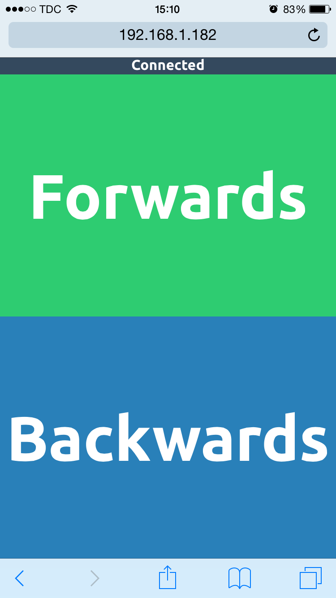

#LEGO Train Driver

Project for making a LEGO train go by the touch of a button on a phone.

#Running

Run the entire package on the Tessel by issuing the command `tessel run .` in the directory of the project.

Visit the Tessel's IP in a browser, and you should see this lovely interface:

The green diode on the Tessel will turn on when there is an active socket connection. The blue when the train is driving.