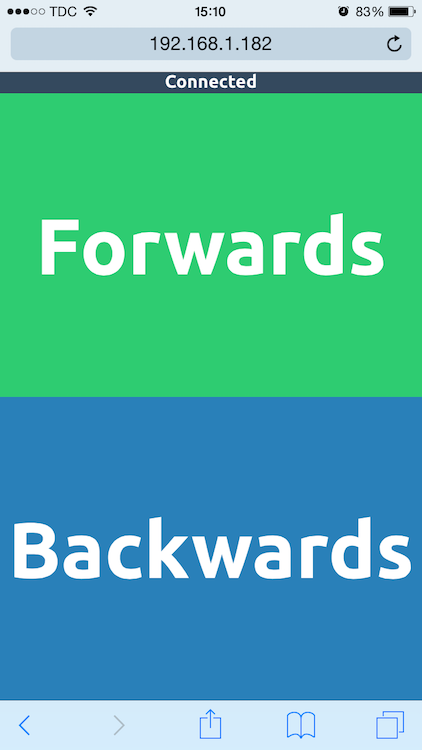

#LEGO Train Driver

Project for making a LEGO train go by the touch of a button on a phone.

#Running

First make sure you have all the packages installed by running `npm install`, and then run the entire package on the Tessel by issuing the command `tessel run .`.

Visit the Tessel's IP in a browser, and you should see this lovely interface ([Tessel WiFi docs](http://start.tessel.io/wifi)):

The green diode on the Tessel will turn on when there is an active socket connection. The blue when the train is driving.